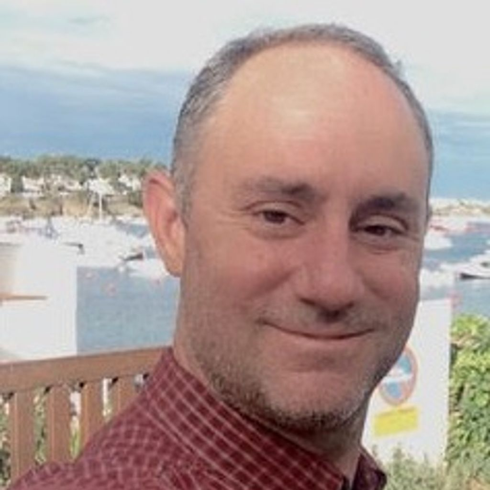
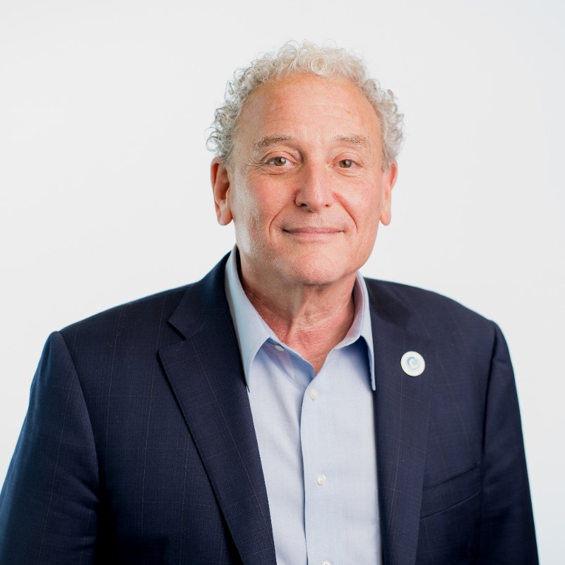
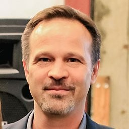
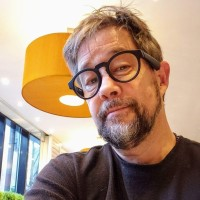
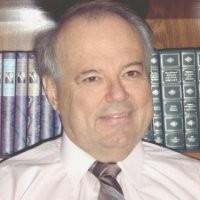
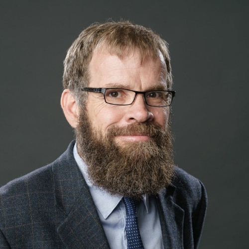
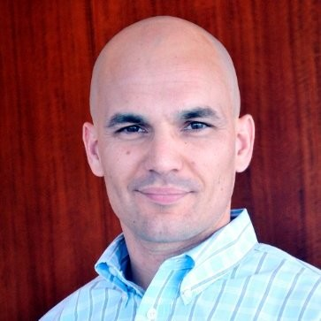

# OBADA BOD Members
_Updated Nov 19, 2023_

### Chairman of the Board
### Rohi Sukhia | Tradeloop Corporation | United States

In 2017, Rohi founded the OBADA (Open Blockchain for Asset Disposition Architecture) Foundation, a nonprofit consortium of key stakeholders in the ITAD sector.. a “blockchain” to provide traceability in asset disposition. Previously, Rohi founded Tradeloop Corporation in 1997, where he remains today as CEO.  Rohi also currently sits on the board of repair.org, fighting for our right to repair.  Previously, Rohi spent seven years at Intel after obtaining a BS in Electrical Engineering from Cornell.
 

[Connect with Rohi](https://www.linkedin.com/in/rohinton)
  

### Treasurer
### Joe Marion | ASCDI | United States

Focusing on helping technology resellers, communications, service providers and ITAD firms learn, grow and network with each other, worldwide.
 

[Connect with Joe](https://www.linkedin.com/in/josephmarion/)
  

### Additional Board Members
### Charles Brennick | TechReuse | United States

Founder of largest nonprofit computer reuse and recycling organization in the Northwest and has over twenty years of experience in the field of IT asset disposition (ITAD), IT for Development (IT4D), recycling, and electronics reuse. A demonstrated leader with practical experience in community outreach, business development, operations, fundraising, ecommerce, and sales.  

[Connect with Charles](https://www.linkedin.com/in/charles-brennick-52560a3/)
  

### Robin Ingenthron | Good Point Recycling | United States

"Trying to recreate my Peace Corps experience through my business, bringing wealth and value to friends overseas through fair trade environmental standards..." Ingenthron believes that the amount of money society will make available to improve the environment is finite, and believes regulation of the free market must be done wisely and sparingly. When recycling isn't working in the free market, there is usually a cause. The amount of material or scale of collection may be too limited, or there may be a subsidy on virgin material (General Mining Act of 1872). 

 [Connect with Robin](https://www.linkedin.com/in/robiningenthron/)

  

### Kenneth Jacobsen | Reverse Logistics Association | United States

Specialties: Mobile computing, telecom, strategic planning, Currently involved with standards setting (ANSI) in both blockchain and product labeling protocols. Previously involved with establishing standards setting related to memory cards and infrared communications as well as participating in USB, Bluetooth and Software Defined Radio standards bodies.
 

 [Connect with Ken](https://www.linkedin.com/in/jacobsenken/)

  

### Ronald Lembke | University of Nevada | United States

Professor, Supply Chain Management, Chair of Marketing Department, at University of Nevada, Reno
 

 [Connect with Ron](https://www.linkedin.com/in/ron-lembke-920b011/)

  

### Guennael "G" Delorme | Allstate | United States

Guennael "G" Delorme is a long-time member of the mobility and reverse logistics industries. While at Samsung, he launched and ran both the first certified pre-owned phone and the first OEM trade-in program in the mobility industry, beating Apple to market by 18 months each time. Now at Allstate, G focuses on building global exchange programs in the used consumer electronics space. A strong believer in both blockchain and the circular economy, G completed Columbia Business School's "Blockchain in business: beyond the hype" in 2021 and is currently the CTIA 'RLSQ grading scales' 2024 co-chair.

 [Connect with Guennael](https://www.linkedin.com/in/guennaeldelorme/)

  

